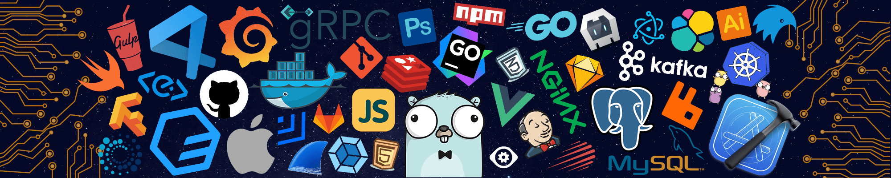

<h1 align="center"> Hi, This is Suman Karan </h1>

  

## <picture></picture> **About me**

<picture> </picture>

 

- A comp-science undergraduate student
- A passionate  Front-end developer
- A aspiring software developer with good problem-solving skills
- Able to perform well in a team
- Passionate about coding and equipped with a diverse and promising skill-set

  

  
## <b> Skills</b>
 

### 👉 Programming languages

    
     
    
    

### 👉 Frontend Development

   

    
    
   

### 👉 Databases
 

 <a href="https://www.mysql.com/" target="_blank"> 
    
  <a href="https://www.postgresql.org" target="_blank"> 
     
      <a href="https://www.oracle.com/in/" target="_blank"> 
     
         
 ### 👉 Design
 

 
  <a href="https://www.adobe.com/in/products/photoshop/" target="_blank"> 
      
    
   <a href="https://www.figma.com/design/" target="_blank"> 
      
    
   <a href="https://www.canva.com/en_in/" target="_blank"> 
    
    
      
  
   
### 👉 Competitive Programming & Problem Solving
 

    
    
    

### 👉 Operating Systems
 

    
    
    

 ### 👉 Preferred IDEs  & Tools
 

    
    
  
  
    

 
  

  

<h2>Lets  Connect!  </h2>

  
  
  
  
  
 

 

  
   

  

Credits: [Suman Karan](https://github.com/karanSuman)

Last Edited on: 03/01/2023

 

